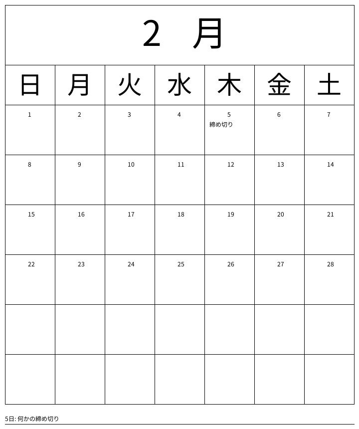

<p align="right">


</p>

<p align="center">

</p>

# 📅make calender


## 目次

- [🔧技術スタック](#-🔧技術スタック)
- [⚙️仕様](#-⚙️仕様)
- [🚀HowToStart](#-🚀HowToStart)

## 🔧技術スタック

<p>


</p>

## ⚙️仕様

postするとカレンダー画像をbase64のバイト列で返します \
Authキーは問い合わせください

### 🪜ディレクトリ構造

```sh
.
├── Dockerfile
├── LICENSE
├── README.md
├── app
│   ├── __pycache__
│   ├── drawBaseImg.py
│   ├── drawDescription.py
│   ├── drawMonthly.py
│   ├── font
│   │   └── NotoSansJP-Regular.ttf
│   ├── img
│   │   └── image.png
│   ├── main.py
│   └── requirements.txt
└── docker-compose.yml
```

### 📕ライブラリ

<p>


</p>

### Curl

```bash
curl -X 'POST' \
  'http://localhost:8000/calender/' \
  -H 'accept: application/json' \
  -H 'Authorization: expected_token' \
  -H 'Content-Type: application/json' \
  -d '{
  "year": 2026,
  "month": 2,
  "tasks": [
    {
      "day": 5,
      "title": "締め切り",
      "description": "何かの締め切り"
    }
  ]
}'
```
お試し↓
```bash
curl -X 'POST' \
  'https://calendar-api-service-406088920323.asia-northeast1.run.app/calender' \
  -H 'accept: application/json' \
  -H 'Authorization: Nadvqnr4cou7rA3PlW/JAw==' \
  -H 'Content-Type: application/json' \
  -d '{
  "year": 2026,
  "month": 12,
  "tasks": [
    {
      "day": 4,
      "title": "string",
      "description": "string"
    }
  ]
}'
```

### RequestBody-example

```json
{
  "year": 2026,
  "month": 2,
  "tasks": [
    {
      "day": 5,
      "title": "締め切り",
      "description": "何かの締め切り"
    }
  ]
}
```

### Response-example

#### Response Headers

```
 content-length: 88582
 content-type: application/json
 date: Sun,15 Feb 2026 17:44:34 GMT
 server: uvicorn
```

#### Response Body

```json
[
  {
    "res": "ok",
    "base64": "/9j/4AAQSkZJRgABAQAAAQA..."
  }
]
```

#### 生成画像



## 🚀How To Start

```bash
cd makeCalender
docker compose up -d --build
# 動作確認用
docker compose logs -f

# {"message":"Hello, World"}が返ってきたら成功
curl 'http://localhost:8000'
```
